### 购买华为云服务器流程
购买过程大概花费十分钟，如果是按需付费的话，便宜的机器有两三块钱一天的，用来做一些服务器上的实践应该还是蛮不错的。

#### 访问购买链接
https://console.huaweicloud.com/ecm/?region=cn-east-2#/ecs/createVm

#### 选择服务器规格
这里我选的是按需计费的鲲鹏通用计算增强型机器，价格是0.12元/小时，可根据个人情况选择按需购买还是包年包月。
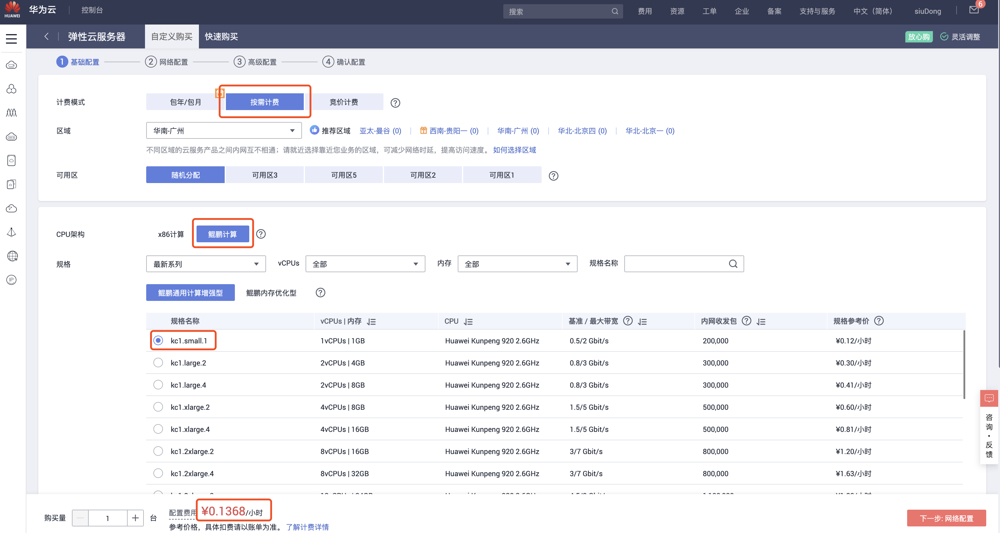

#### 选择镜像和系统盘
选择CentOS 8.0
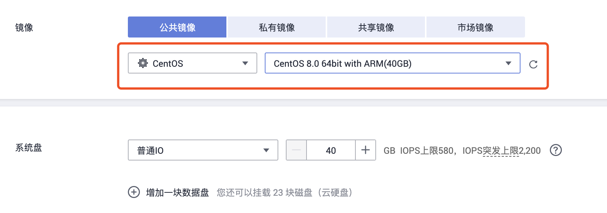

#### 选择网络
因为我只用来做一下灰度发布的演示，用不了几天，所以选择了按流量计费。
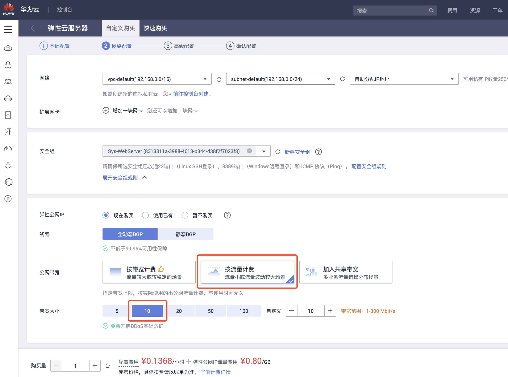

#### 设置服务器密码
这个是服务器的登录密码，一定不能忘记。


#### 确认信息
要确认的信息包括你刚刚选择的配置和购买的台数，因为要做灰度发布需要两台机器，所以我买了两台。一台也可以操作，就是会麻烦一点。记得勾选阅读并同意的checkbox，不然不能购买。
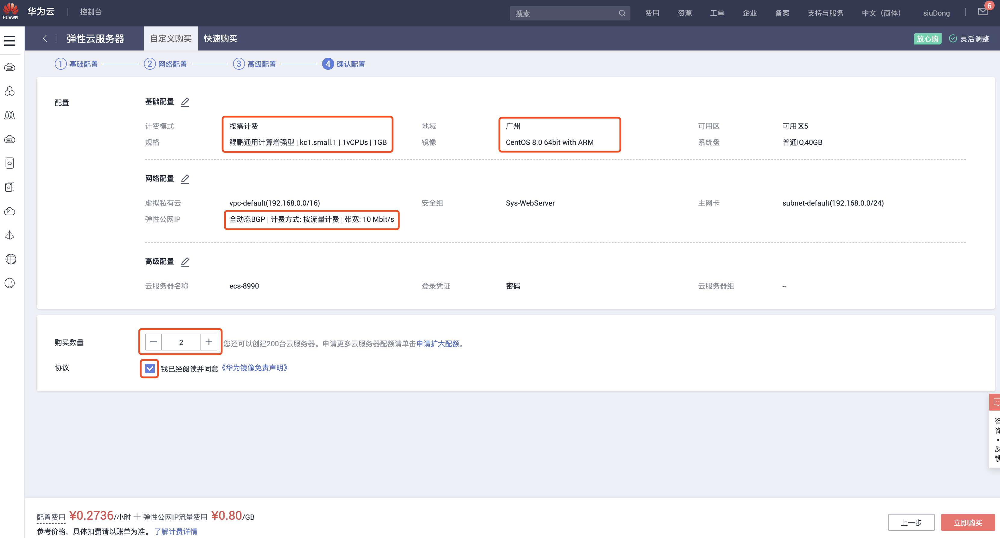

#### 查看机器
点击购买后，可以再次点击弹出框按钮跳转到到控制台主界面。此时不需要付费，但是最好先充几十块钱进去，否则过一个多小时就会因为欠费而关机。在控制台这里，稍微等一会，可以看到已经有了两台服务器，并且都配备了公网地址。
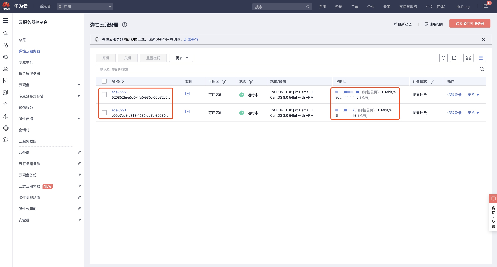

### 搭建服务器环境
#### 登录服务器
可以在华为云控制台点击远程登录连接，或者在本地使用终端工具连接，我比较倾向于使用后一种办法。先测试一下看看两台服务器能否正常连接。
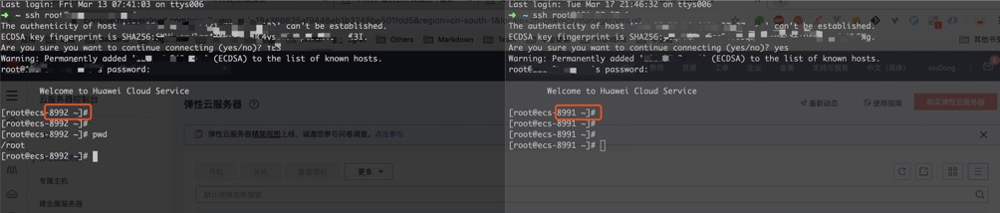

#### 安装Nginx
先选择一台服务器，开始安装Nginx，CentOS 8.0下安装Nginx非常简单：
```
sudo yum install nginx
```
安装完了，在终端输入nginx -t检查一下是否安装成功。如果安装成功，它会显示nginx配置文件的状态，以及位置。
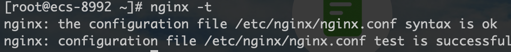

此时nginx还没有启动，在终端中输入nginx或nginx -s reload命令即可启动，此时看到的nginx相关进程如下，表明已经启动成功。
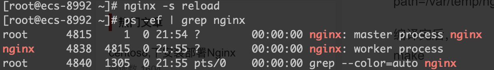

在浏览器里访问你的服务器公网ip，如果能看到下面的页面说明nginx真的启动成功。
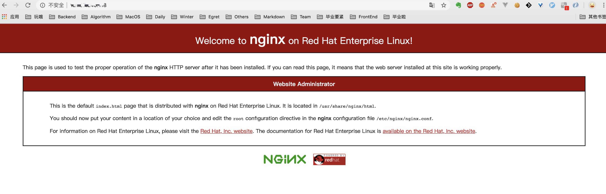

### 本地准备代码
因为要做灰度部署，所以需要准备两份不一样的代码，以验证我们实施的灰度操作是否生效。这里选择使用angular的angular-cli来创建代码。创建的项目并不简洁，但是胜在操作简单.
```
// 安装angular-cli，前提是已经安装了node，如果没有node真的要去自行百度了...
npm install -g @angular/cli
// 快速创建一个新项目，一路回车
ng new canaryDemo
cd canaryDemo
// 运行完这个命令后访问http://localhost:4200 查看页面信息
ng serve
```
访问localhost的4200端口查看页面，然后把项目根目录下src中的index.html的title改成A-CanaryDemo，可以看到页面会进行实时地刷新。我们用title 来标识灰度发布过程中两边不同的服务需要部署的代码。
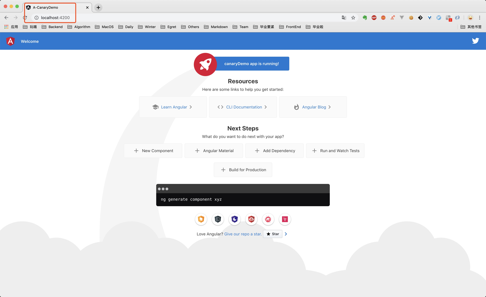
打包之后，根目录的dist目录下多了项目同名的文件夹，把这个拷贝到我们刚刚申请的第一台，也就是我们安装了nginx的服务器上
```
// 上面一步检查没问题，把项目打包一下，准备发送到服务器
ng build --prod
// 打包出来的文件会放在根目录下的dist下，将该文件夹复制到你的公网服务器上，xx部分是你的服务器公网ip
scp -r ./dist/canaryDemo root@xx.xx.xx.xx:/var
```

#### 服务器更新配置
先去服务器上/var 的位置上看一下，是否已经有了这个文件，如果有了的话，接着到下一步。
即修改Nginx配置把访问该服务器IP 的请求转发到我们刚刚上传上来的页面上。上满提到过可以通过nginx -t这个命令来查看Nginx 配置文件的位置，在这一步，我们要去编辑那个文件。
```
vi /etc/nginx/nginx.conf
```
修改47-50行添加下图相关的内容，即将访问到该服务器IP 的流量转发到/var/canaryDemo 下的index.html.
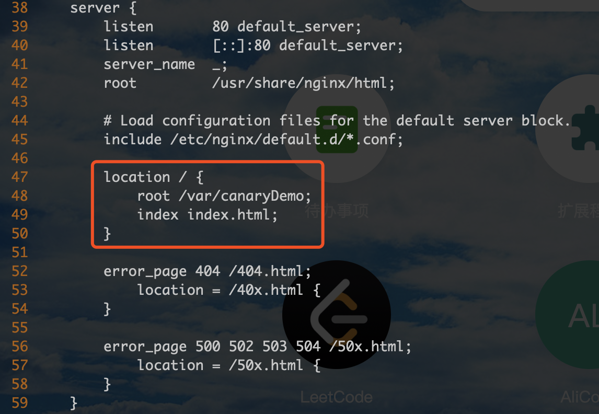

修改完毕，保存退出，重启一下nginx
```
nginx -s reload
```
这时候可以看到页面已经变成了刚刚我们在本地改的页面，而且title确实是A-CanaryDemo
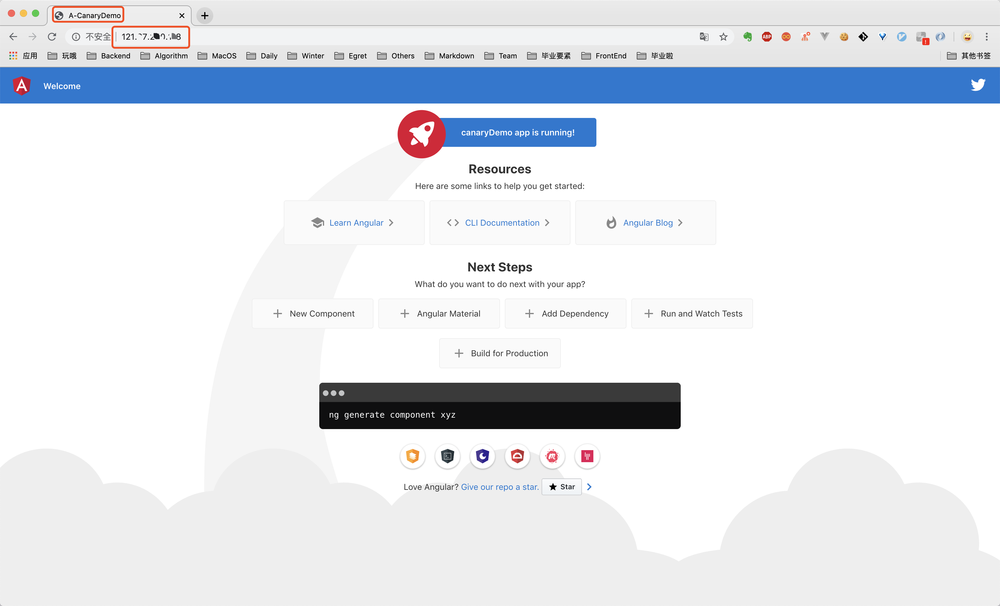

#### 操作另一台服务器
接着，我们现在把本地代码中的title 改成B-CanaryDemo，然后用同样的方法打包，并把打包结果发送到第二台服务器上，记得在第二台服务器上也安装配置Nginx，然后手动测试一下第二台服务器的网站能否访问成功。至此，服务器的购买和两个“版本”代码的服务器部署已经完成。


### 灰度发布

#### 指定灰度策略
我们以cookie 为指标进行流量的分配。

#### 服务器安装Jenkins

#### 建立灰度发布相关的Jenkins任务

#### 配置Nginx灰度策略

#### 通过按钮调用Jenkins任务的执行


