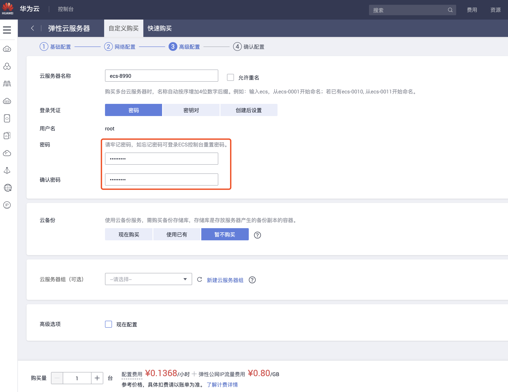

## 购买华为云服务器

#### 访问购买链接
https://console.huaweicloud.com/ecm/?region=cn-east-2#/ecs/createVm

#### 选择服务器规格
这里我选的是按需计费的鲲鹏通用计算增强型机器，价格是0.12元/小时，可根据个人情况选择按需购买还是包年包月。

#### 选择镜像和系统盘
选择CentOS 8.0

#### 选择网络
因为我只用来做一下灰度发布的演示，用不了几天，所以选择了按流量计费。

#### 设置服务器密码
这个是服务器的登录密码，一定不能忘记。

#### 确认信息
要确认的信息包括你刚刚选择的配置和购买的台数，因为要做灰度发布需要两台机器，所以我买了两台。一台也可以操作，就是会麻烦一点。记得勾选阅读并同意的checkbox，不然不能购买。

#### 查看机器
点击购买后，可以再次点击弹出框按钮跳转到到控制台主界面。此时不需要付费，但是最好先充几十块钱进去，否则过一个多小时就会因为欠费而关机。在控制台这里，稍微等一会，可以看到已经有了两台服务器，并且都配备了公网地址。

登录一下，两台机器都没问题

开始安装nginx
sudo yum install nginx
安装完了，nginx -t看一下，它会告诉你nginx配置文件的状态，以及位置

此时nginx还没有启动

reload一下nginx，然后直接访问你当前操作的这台机器的公网地址

通了

本地创建一个项目，打包放到这台服务器上，这里使用angular-cli创建，创建的项目并不简洁，但是胜在操作简单
先安装cli

开始创建项目
Ng new canaryDemo  // 一路回车
Cd canaryDemo
Ng serve
Ng build —prod
// 不能放在root下，不然页面403
Scp -r ./dist/canaryDemo root@121.37.240.118:/var
访问通了，先把index.html的title改成A-CanaryDemo
打包之后，根目录的dist目录下多了项目同名的文件夹，把这个拷贝到我们刚刚申请的第一台，也就是我们安装了nginx的服务器上

去服务器上看一下，已经有了这个文件

修改nginx配置把访问ip的请求转发到我们刚刚上传上来的位置

完事保存当前的修改，重启一下nginx
Nginx -s reload

这时候可以看到页面已经变成了刚刚我们在本地改的页面，而且title确实是A-CanaryDemo

接着，我们现在把title改成B-CanaryDemo，然后用同样的方法打包，并把打包结果送到第二台服务器上。这台服务器不用安装nginx，scp完了去服务器上确认有这个文件夹就可以了
Ng build —prod
// 不能放在root下，不然页面403
Scp -r ./dist/canaryDemo root@121.37.240.118:/var

关于费用问题，购买了一个半小时以后。就短信提示费用不足，然后直接给关机了，体验不好，而且只是欠费不到一毛钱。
到此为止就实现了代码在服务器上可访问。

接下来要做的是通过nginx进行流量分发，配置灰度测策略。

还是注册个域名吧

查找域名，买个最便宜的

要创建个人信息，否则购买按钮是灰色的

买完了以后，绑定域名到服务器。登录网站：
https://console.huaweicloud.com/dns/?region=cn-south-1#/dns/publicRset?zoneid=8aace3ba70cb02fe0170e91e182e5625&zonename=siudong.top.
https://console.huaweicloud.com/webmobile/?region=cn-south-1#/cloudsite/website

点击域名解析

域名指向你的nginx机器

为啥要加域名这一段，因为我发现两台服务器，一台nginx做流量转发，转发的对象之一又是自己，所以流量到自己身上会出现死循环，从而报错，走到nginx的50x.html页面。于是我想到一个非常骚的操作，把这个html替换成我自己的html不就完事了。于是利用两台服务器就能实现静态页面的灰度发布了！！