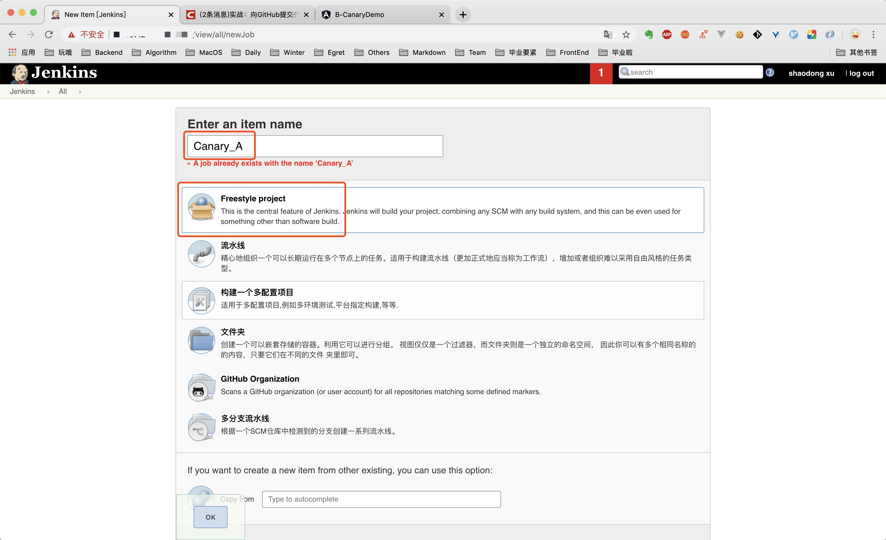

### 安装Jenkins
第一次接触Jenkins 可能会有很多疑问，Jenkins 是什么？能完成什么事情？我为什么要使用Jenkins 等诸如此类。很难讲清楚Jenkins 是什么东西，所以这里简单介绍一下Jenkins 可以做什么。简单来讲，你在任何一台服务器上进行的任何操作命令，Jenkins 都可以帮你完成，只要你提前在Jenkins上创建好任务，指定任务内容和触发时机，比如定时触发或者在特定的情况下触发。
#### 下载
Jenkins稳定版本list：http://pkg.jenkins-ci.org/redhat-stable/
```
// 科学上网会快一些，记得留意网站上java和jenkins版本匹配信息，别下错了
wget http://pkg.jenkins-ci.org/redhat-stable/jenkins-2.204.5-1.1.noarch.rpm
rpm -ivh jenkins-2.7.3-1.1.noarch.rpm
```

修改Jenkins端口，不冲突可不修改
```
// line 56 JENKINS_PORT
vi /etc/sysconfig/jenkins
```
#### 启动
启动jenkins
```
service jenkins start/stop/restart
// 密码位置
/var/lib/jenkins/secrets/initialAdminPassword
```
#### 访问
访问服务器的8080端口，输入从上述位置获取的密码，点击继续


创建一个账户然后登录


开始使用Jenkins


#### 创建Jenkins任务
在创建Jenkins任务之前我们先梳理一下要达到灰度发布的目标需要哪几个任务，以及每个任务负责完成什么事情。灰度发布一般遵循这样的流程（假设我们有AB两台服务器用于提供生产环境的服务，我们称之为AB边）：
（1）新代码部署到A边
（2）符合灰度策略的小部分流量切到A边，剩余大部分流量仍去往B边
（3）手动验证A边功能是否正常可用
（4）验证无误后，大部分流量转到A边，灰度流量去往B边
（5）手动验证B边功能是否正常可用
（6）验证无误后，流量像往常一样均分到AB边


#### 任务拆解
通过上述的拆解，我们得出灰度发布的6个步骤，其中（3）和（5）是需要手动验证的环节，所以我们以这两个任务为分割点，建立三个Jenkins 任务如下：
（1）灰度测试A，这个任务又包含两个部分，更新A边的代码，然后修改流量分发策略使得灰度流量到达A，其他流量到达B
（2）上线A灰度测试B，更新B边代码，灰度流量达到B，其他流量到达A
（3）上线B，所有流量均分到AB

#### 创建任务
先按照任务拆解部分的设定创建三个FreeStyle 类型的Jenkins 任务。任务详情信息可以不填，直接保存就好，下一步我们再来配置每个任务的具体信息。



#### 配置任务


### 可能问题
Jenkins版本和Java版本不匹配，会导致一下问题，无法登录，解决方法按上面说的寻找匹配版本
