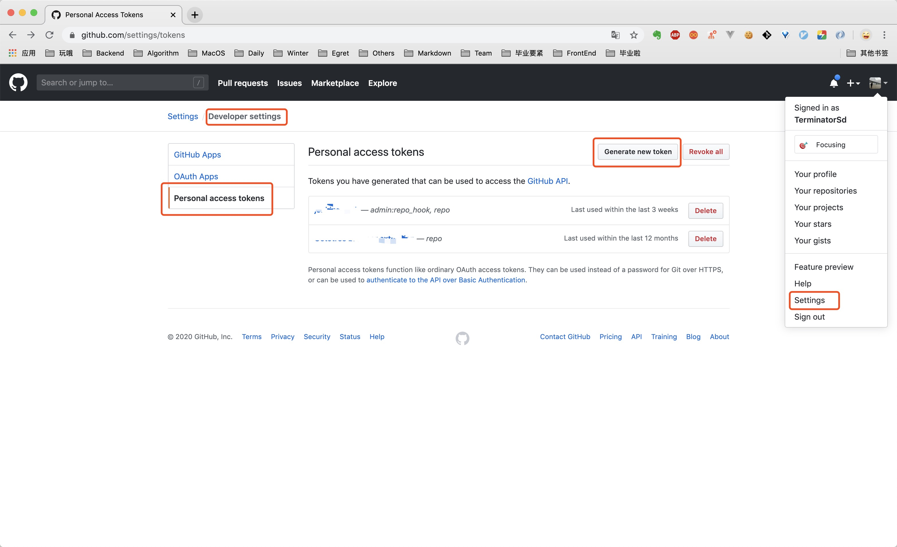
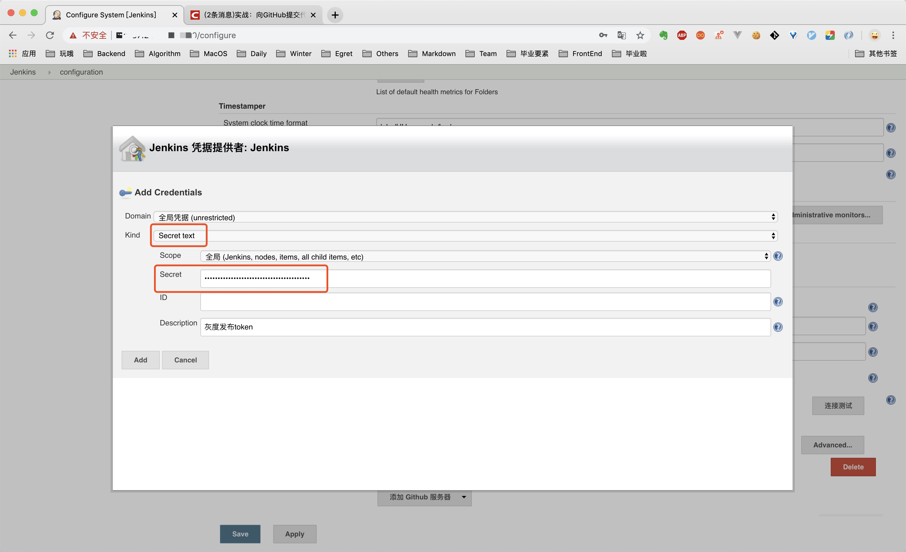

### github 生成token
要实现github 的代码提交触发Jenkins 任务自动执行，需要在github 上生成token，然后添加到Jenkins 中。

回到上一个页面，发现我们新建的token 已经有了，此时是一串字符串的形式，把它记录下来，后面要用到，刷新一下页面，字符串消失，换成token 名字。

现在回到Jenkins 页面，先退出刚刚那个Jenkins 任务，进入Jenkins 系统管理，把刚刚在github 上生成的token 放到这里

往下拉，找到github，点击添加一个github server

在弹出的对话框中，Kind 选择Secret text，Secret 输入刚刚在github 生成token 时记录下的那一段字符串

添加Add 对话框关闭，回到上一个页面，凭据选择刚刚添加这个，点击连接测试，没问题后点击保存按钮。

