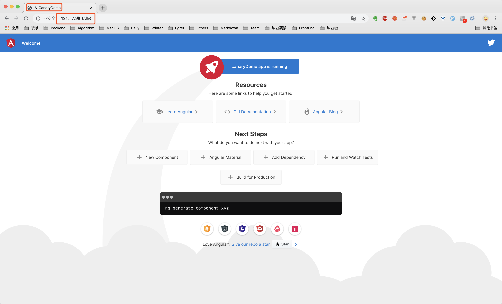
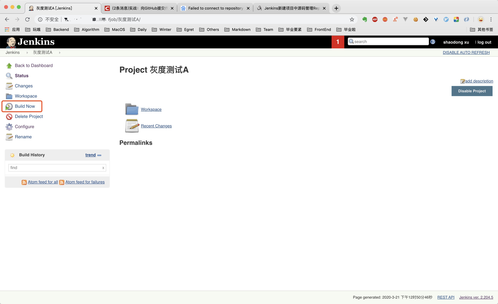
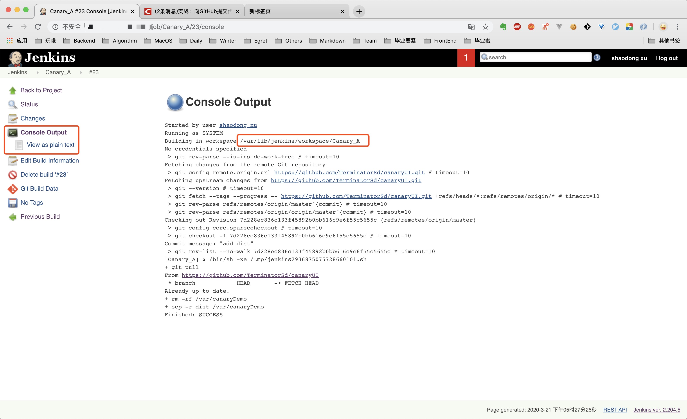

# 从零搭建一个灰度发布环境

## 引言
灰度发布，又称金丝雀发布。

> 金丝雀发布这一术语源于煤矿工人把笼养的金丝雀带入矿井的传统。矿工通过金丝雀来了解矿井中一氧化碳的浓度，如果一氧化碳的浓度过高，金丝雀就会中毒，从而使矿工知道应该立刻撤离。  ——《DevOps实践指南》

对应到软件开中，则是指在发布新的产品特性时通过少量的用户试点确认新特性没有问题，确保无误后推广到更大的用户使用群体。

集成灰度发布的流水线在DevOps中是一个非常重要的工具和高效的实践，然而笔者在入职以前对流水线和灰度发布知之甚少。在了解一个新东西时，我倾向于先从逻辑上打通所有的关键环节，然后再完成一个最简单的Demo，因此就有了这篇文章。

本文理论内容较少，主要是从零到一的搭建流程实践，适合对工程化感兴趣的初级前端开发者。

## 01 服务器准备

### 获取服务器
上面提到，灰度发布是通过少量的用户试点来验证新功能有没有问题。所以要保证有两批用户能在同一时间体验到不同的功能。这就要求我们准备两台服务器，分别部署不同的代码版本。

如果你已经有了一台服务器，也可以通过在不同端口部署服务的方式来模拟两台服务器。如果你还一台服务器都没有，那么可以参考这个过程购买两台云服务器，如果是按需购买，完成本文的Demo，大概要花费20块钱。

获取云服务器教程：https://github.com/TerminatorSd/canaryUI/blob/master/HuaWeiCloudServer.md

### 工具安装
#### Git
首先，确保你的服务器上已经安装了git，如果没有的话使用以下命令进行安装，安装好了以后生成ssh 公钥，放到你的github 里，后面拉取代码的时候会用到。
```
yum install git
```
#### Nginx
如果你的服务器没有Nginx，先按照以下操作进行安装，Linux 下安装Nginx非常简单：
```
sudo yum install nginx
```
安装完了，在终端输入nginx -t检查一下是否安装成功。如果安装成功，它会显示Nginx 配置文件的状态，以及位置。


此时nginx还没有启动，在终端中输入`nginx` 或`nginx -s reload` 命令即可启动，此时看到的nginx相关进程如下，表明已经启动成功。


在浏览器里访问你的服务器公网IP，如果能看到下面的页面说明Nginx 可以正常工作。


#### Jenkins (耗时比较久)
第一次接触Jenkins 可能会有很多疑问，Jenkins 是什么？能完成什么事情？我为什么要使用Jenkins 等诸如此类。很难讲清楚Jenkins 是什么东西，所以这里简单介绍一下Jenkins 可以做什么。简单来讲，你在任何一台服务器上进行的任何操作命令，Jenkins 都可以帮你完成，只要你提前在Jenkins上创建好任务，指定任务内容和触发时机，比如定时触发或者在特定的情况下触发。
（1）安装
Jenkins稳定版本list：http://pkg.jenkins-ci.org/redhat-stable/
```
// 科学上网会快一些，记得留意网站上java和jenkins版本匹配信息，别下错了
wget http://pkg.jenkins-ci.org/redhat-stable/jenkins-2.204.5-1.1.noarch.rpm
rpm -ivh jenkins-2.7.3-1.1.noarch.rpm
```

修改Jenkins端口，不冲突可不修改
```
// line 56 JENKINS_PORT
vi /etc/sysconfig/jenkins
```
（2）启动
启动jenkins
```
service jenkins start/stop/restart
// 密码位置
/var/lib/jenkins/secrets/initialAdminPassword
```
（3）访问
访问服务器的8080端口，输入从上述位置获取的密码，点击继续


创建一个账户然后登录


看到Jenkins 已就绪的页面表示安装已经完成，服务器准备工作到此结束。


## 02 代码准备

### 准备两份代码
因为要做灰度部署，所以需要准备两份不一样的代码，以验证我们实施的灰度操作是否生效。这里选择使用Angular 的Angular-CLI 来创建代码。创建的项目并不简洁，但是胜在操作简单。我们一次性把两份代码准备好，简化开发侧工作。
```
// 安装angular-cli，前提是已经安装了node，如果没有node真的要去自行百度了...
npm install -g @angular/cli
// 快速创建一个新项目，一路回车
ng new canaryDemo
cd canaryDemo
// 运行完这个命令后访问http://localhost:4200 查看页面信息
ng serve
```
访问localhost 的4200 端口查看页面，然后把项目根目录下src 中的index.html 的title 改成A-CanaryDemo，可以看到页面会进行实时地刷新。在这个例子中，我们用title 来标识灰度发布过程中两边不同的服务需要部署的代码。


接下来，我们进行两次打包，两次打包的title 分别为A-CanaryDemo 和 B-CanaryDemo，
把这两个文件夹放好备用，作为一会灰度发布的新老代码。
```
ng build --prod
```


### 配置Nginx
在上述完成Nginx 的安装操作时，我们访问服务器的IP 看到的是Nginx 的页面，现在我们想访问到自己的页面，首先把上面打包得到的A-CanaryDemo 发送到两台服务器上任意位置，这里我们把它放到/var/canaryDemo。
```
// 将A-CanaryDemo 文件夹复制到你的公网服务器上，xx部分是你的服务器公网ip
scp -r ./dist/A-CanaryDemo root@xx.xx.xx.xx:/var/canaryDemo
```

去服务器上/var 的位置上看一下，是否已经有了这个文件，如果有了的话，接着到下一步。即修改Nginx 配置把访问该服务器IP 的请求转发到我们刚刚上传上来的页面上。上满提到过可以通过nginx -t 这个命令来查看Nginx 配置文件的位置，在这一步，我们要去编辑那个文件。
```
vi /etc/nginx/nginx.conf
```
修改47-50行添加下图相关的内容，即将访问到该服务器IP 的流量转发到/var/canaryDemo 下的index.html.


修改完毕，保存退出，重启一下nginx
```
nginx -s reload
```
这时候去访问我们服务器的IP 地址可以看到页面已经变成了刚刚我们在本地改的页面，而且title 确实是A-CanaryDemo。两台服务器都操作完成后，两边都可以访问到title 为A-CanaryDemo 的页面。此时的状态相当于生产环境已经在提供稳定服务的两台机器。



## 03 定义灰度策略
接下来，我们要开始进行灰度发布的部分，在进行相关操作之前，我们需要定义一个灰度策略，即满足什么情况下的流量会走到灰度边，而其他流量走向正常边。这里为了简单起见，我们使用名字为canary 的cookie 来区分，如果检测到这个cookie 的值为devui，就访问灰度边机器，否则就访问正常边机器。按照此规则配置Nginx 结果如下：
```
# Canary Deployment
map $COOKIE_canary $group {
    # canary account
    ~*devui$ server_canary;
    default server_default;
}

upstream server_canary {
    # 两台机器的IP
    server x.x.x.x  weight=1 max_fails=1 fail_timeout=30s;
    server x.x.x.x weight=1 max_fails=1 fail_timeout=30s;
}

upstream server_default {
    server x.x.x.x weight=1 max_fails=1 fail_timeout=30s;
    server x.x.x.x weight=1 max_fails=1 fail_timeout=30s;
}

server {
    listen       80 default_server;
    listen       [::]:80 default_server;
    server_name  _;
    # root         /usr/share/nginx/html;
    root         /var/canaryDemo;

    # Load configuration files for the default server block.
    include /etc/nginx/default.d/*.conf;

    location / {
        proxy_pass http://$group;
        # root /var/canaryDemo;
        # index index.html;
    }

    error_page 404 /404.html;
        location = /40x.html {
    }

    error_page 500 502 503 504 /50x.html;
        location = /50x.html {
    }
}
```
此时，灰度流量和正常流量都会随机分配到AB两边的机器。下面，我们通过建立Jenkins 任务执行Nginx 文件修改的方式实现灰度发布。

## 04 实现灰度发布

### 创建Jenkins任务
在创建Jenkins任务之前我们先梳理一下要达到灰度发布的目标需要哪几个任务，以及每个任务负责完成什么事情。灰度发布一般遵循这样的流程（假设我们有AB两台服务器用于提供生产环境的服务，我们称之为AB边）：
（1）新代码部署到A边
（2）符合灰度策略的小部分流量切到A边，剩余大部分流量仍去往B边
（3）手动验证A边功能是否正常可用
（4）验证无误后，大部分流量转到A边，灰度流量去往B边
（5）手动验证B边功能是否正常可用
（6）验证无误后，流量像往常一样均分到AB边

#### 任务拆解
通过上述的拆解，我们得出灰度发布的6个步骤，其中（3）和（5）是需要手动验证的环节，所以我们以这两个任务为分割点，建立三个Jenkins 任务（Jenkins 任务建立在A 边机器上）如下：
（1）Canary_A（灰度测试A），这个任务又包含两个部分，更新A边的代码，然后修改流量分发策略使得灰度流量到达A，其他流量到达B
（2）Canary_AB（上线A灰度测试B），更新B边代码，灰度流量达到B，其他流量到达A
（3）Canary_B（上线B），所有流量均分到AB


#### 创建任务
先按照任务拆解部分的设定创建三个FreeStyle 类型的Jenkins 任务，记得使用英文名字，中文名字后面建文件夹比较麻烦。任务详情信息可以不填，直接保存就好，下一步我们再来配置每个任务的具体信息。


#### 配置任务
现在已经创建好了三个任务，先点击进入每一个任务进行一次空的构建（否则后面可能导致修改后的构建任务无法启动），然后我们来对每个任务进行详细的配置。


现代前端项目都要进行构建打包这一步。但是廉价的1核2G的云服务器在完成构建方面有些力不从心，CPU 经常爆表。**所以我们在这里把打包出得出的生产包纳入git 管理，每次的代码更新会同步最新的生产包到github，因此Jenkins 任务把生产包拉下来，放在指定位置即可完成一次新代码的部署。**

这一步操作，其实我们在之前就已经完成了，我们在上面打了两份tilte 不一样的生产包，此时可以派上用场了。

首先来配置灰度测试A，这个任务内容上面也基本讲清楚了，首先要关联该任务到远程的github 仓库（需要手动创建一个，存放上面打包的B-CanaryDemo，并命名为dist）让它知道可以去哪里拉取最新代码。


执行一次构建任务（在git fetch 那一步耗时不稳定，有时比较久），然后点击本次构建进去查看Console Output，可以确定执行Jenkins 任务的位置是位于服务器上的/var/lib/jenkins/workspace/Canary_A





继续编辑灰度测试A 任务，添加build shell，也就是每次任务执行时要执行的命令：
（1）先拉取最新的代码
（2）把代码根目录下的dist目录复制到部署代码的位置，这里我们指定的位置是/var/canaryDemo
（3）**修改Nginx 配置**使灰度流量到达A边 

就步骤（3）而言，修改灰度流量的方式其实就是**选择性注释Nginx 配置文件**中的内容，注释方式如下即可实现灰度测试A。
```
upstream server_canary {
    # 灰度流量访问A 边
    server 11.11.11.11  weight=1 max_fails=1 fail_timeout=30s;
    # server 22.22.22.22 weight=1 max_fails=1 fail_timeout=30s;
}

upstream server_default {
    # 正常流量访问B 边，为了在修改文件的时候把这段的配置和上面的server_canary 区分开，我们把这里的weight 设为2
    # server 11.11.11.11 weight=2 max_fails=1 fail_timeout=30s;
    server 22.22.22.22 weight=2 max_fails=1 fail_timeout=30s;
}
```

这一步填写的shell 命令在使用jenkins 用户执行时可能会遇到权限问题，可以先用root 用户登录，把/var 目录的归属改为jenkins 用户，/etc/nginx/ngix.conf也需要新增可写权限。由此，最终得到的shell 命令如下：
```
git pull
rm -rf /var/canaryDemo
scp -r dist /var/canaryDemo
sed -i 's/server 22.22.22.22 weight=1/# server 22.22.22.22 weight=1/' /etc/nginx/nginx.conf
sed -i 's/server 11.11.11.11 weight=2/# server 11.11.11.11 weight=2/' /etc/nginx/nginx.conf
```


灰度测试A 任务内容配置完成，接下来依次配置上线A 灰度测试B 和上线B。

灰度测试B 的要执行的任务是把最新的代码拉到A 边（因为我们的Jenkins 任务都是建立在A 边的），复制dist 下的代码到B 边Nginx 指定访问位置，然后修改A 边Nginx 配置，使灰度流量到达B 边。
```
git pull
scp -r dist root@xx.xx.xx.xx:/var/canaryDemo
sed -i 's/# server 22.22.22.22 weight=1/server 22.22.22.22 weight=1/' /etc/nginx/nginx.conf
sed -i 's/# server 11.11.11.11 weight=2/server 11.11.11.11 weight=2/' /etc/nginx/nginx.conf
sed -i 's/server 22.22.22.22 weight=2/# server 22.22.22.22 weight=2/' /etc/nginx/nginx.conf
sed -i 's/server 11.11.11.11 weight=1/# server 11.11.11.11 weight=1/' /etc/nginx/nginx.conf
```
这一步的任务内容涉及到从A 边服务器向B 边服务器发送代码，这个过程一般来说需要输入B 边服务器的密码。我们想要做到免密发送，因此要通过把A 边机器~/.ssh/id_rsa.pub 中的内容添加到B 边服务器~/.ssh/authorized_keys 中使得A 获得免密像B 发送文件的权限。

上线B 则是通过取消对A 边Nginx 配置的注释使所有流量均分到AB 边.
```
sed -i 's/# server 22.22.22.22 weight=2/server 22.22.22.22 weight=2/' /etc/nginx/nginx.conf
sed -i 's/# server 11.11.11.11 weight=1/server 11.11.11.11 weight=1/' /etc/nginx/nginx.conf
```

至此，我们就从零到一搭建了一个灰度发布环境。在代码更新后，通过手动执行Jenkins 任务的方式实现灰度部署和手工测试，保证新功能平滑上线。

最后，在执行灰度测试A 的时候你可能会发现浏览器加载半天跳转到了Nginx 错误页面，因为我们在上述Nginx 的配置中出现了死循环，最终页面跳转到了Nginx 的50x.html，为了解决这个问题，以下命令供你参考！

```
// 结合03 定义灰度策略中server 中的root 配置
cp /var/canaryDemo/index.html /var/canaryDemo/50x.html
```

## 总结

## 加入我们